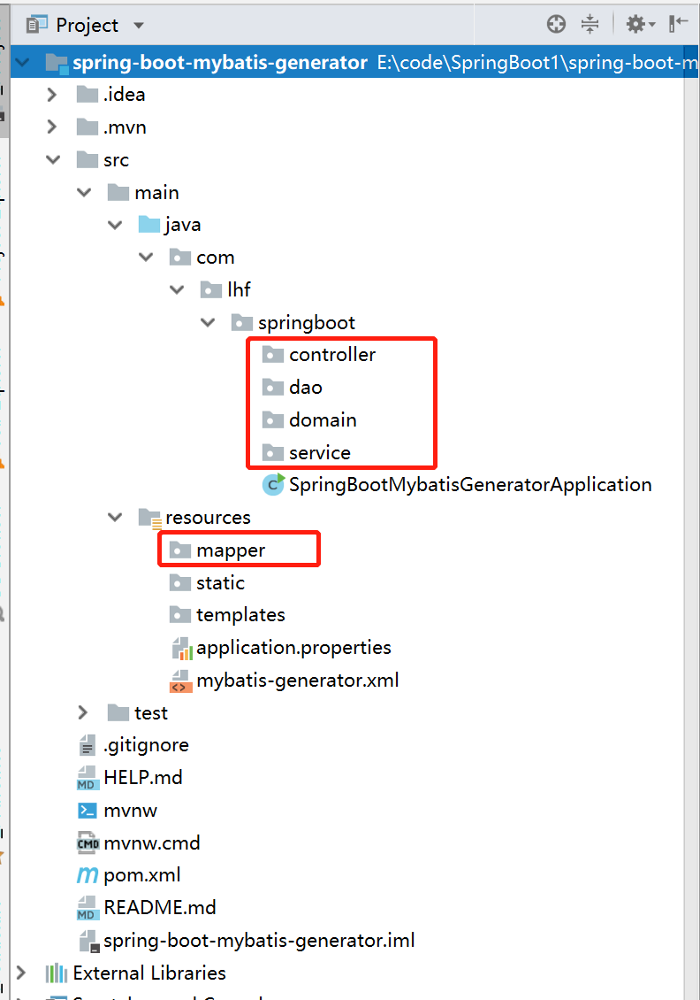
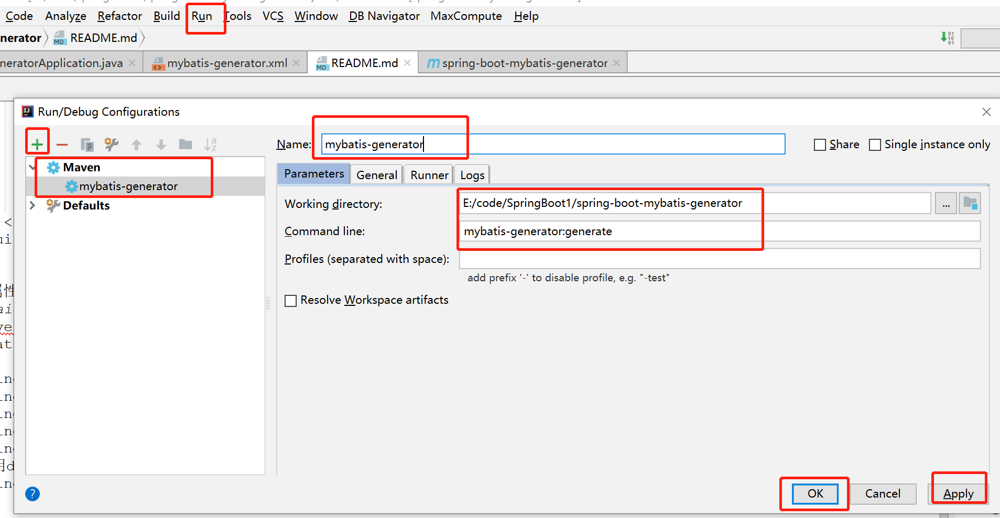
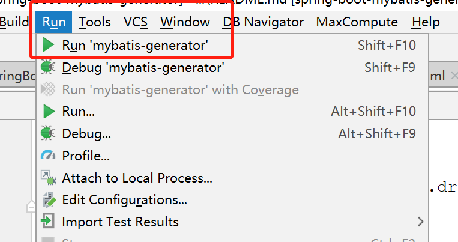

#SpringBoot整合Mybatis实现自动生成代码
###操作步骤
1. 创建SpringBoot工程项目，并创建dao，domain，mapper目录，如下：
   
 
2. 添加pom.xml配置依赖，并修改pom.xml文件
    ```aidl
    <dependency>
        <groupId>org.springframework.boot</groupId>
        <artifactId>spring-boot-starter-web</artifactId>
    </dependency>
    <dependency>
        <groupId>org.mybatis.spring.boot</groupId>
        <artifactId>mybatis-spring-boot-starter</artifactId>
        <version>2.1.0</version>
    </dependency>
    <!-- https://mvnrepository.com/artifact/com.alibaba/druid -->
    <dependency>
        <groupId>com.alibaba</groupId>
        <artifactId>druid</artifactId>
        <version>1.1.20</version>
    </dependency>
    <!-- https://mvnrepository.com/artifact/org.mybatis/mybatis -->
    <dependency>
        <groupId>org.mybatis</groupId>
        <artifactId>mybatis</artifactId>
        <version>3.5.2</version>
    </dependency>
    <dependency>
        <groupId>mysql</groupId>
        <artifactId>mysql-connector-java</artifactId>
        <scope>runtime</scope>
    </dependency>
    <dependency>
        <groupId>org.springframework.boot</groupId>
        <artifactId>spring-boot-starter-test</artifactId>
        <scope>test</scope>
    </dependency>
    ```
    修改pom.xml文件的build结构，替换为如下配置
    ```aidl
    <build>
        <plugins>
            <plugin>
                <groupId>org.springframework.boot</groupId>
                <artifactId>spring-boot-maven-plugin</artifactId>
            </plugin>
            <plugin>
                <groupId>org.mybatis.generator</groupId>
                <artifactId>mybatis-generator-maven-plugin</artifactId>
                <version>1.3.7</version>
                <dependencies>
                    <dependency>
                        <groupId>org.mybatis.generator</groupId>
                        <artifactId>mybatis-generator-core</artifactId>
                        <version>1.3.7</version>
                    </dependency>
                    <dependency>
                        <groupId>mysql</groupId>
                        <artifactId>mysql-connector-java</artifactId>
                        <version>5.1.46</version>
                    </dependency>
                </dependencies>
                <executions>
                    <execution>
                        <id>mybnatis generator</id>
                        <phase>package</phase>
                        <goals>
                            <goal>generate</goal>
                        </goals>
                    </execution>
                </executions>
                <configuration>
                    <!--允许移动生成的文件-->
                    <verbose>true</verbose>
                    <!--允许自动覆盖文件-->
                    <overwrite>false</overwrite>
                    <configurationFile>
                        src/main/resources/mybatis-generator.xml
                    </configurationFile>
                </configuration>
            </plugin>
        </plugins>
    </build>
    ```

3. 配置属性文件，如下：
    ```aidl
    server.port=8095
    mybatis.mapper-locations=classpath:mapping/*.xml
    
    spring.datasource.driver-class-name=com.mysql.cj.jdbc.Driver
    spring.datasource.url=jdbc:mysql://localhost:3306/seckill?serverTimezone=UTC&useUnicode=true&characterEncoding=utf-8&useSSL=true
    spring.datasource.username=root
    spring.datasource.password=root
    spring.datasource.name=seckill
    #使用druid数据源
    spring.datasource.type=com.alibaba.druid.pool.DruidDataSource
    ```  

4. 编写mybatis-generator.xml文件

5. 配置执行mybatis-generator文件，配置操作步骤：
   Run -> Edit Configurations -> + -> Maven -> 配置,如图
   

6. 执行生成代码，Run -> Run 'mybatis-generator',如图
   

7. 看到日志成功了，到此就完成了代码的自动生成功能了！


